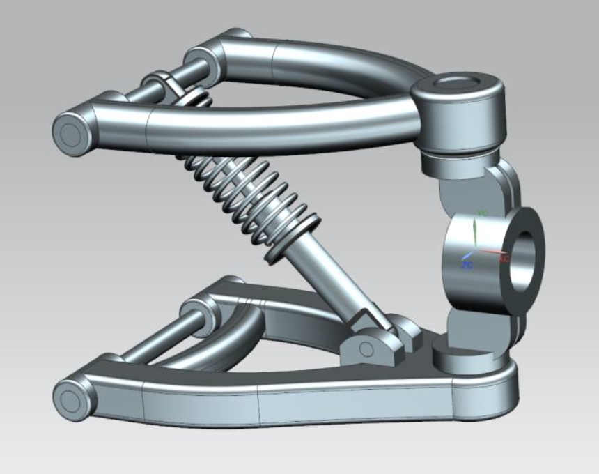

# Double Wishbone Suspension – Structural Design

## Overview  
Modelled and assembled a complete double wishbone suspension system as part of a structural design project. Conducted stress, buckling, and torsion analyses on critical components to assess mechanical behaviour under real-world loading scenarios.

## Objectives  
- Design upper/lower arms, knuckle, pins, spring, and damper in Siemens NX  
- Perform structural analysis (bending, shear, buckling, torsion)  
- Evaluate suitable materials using mechanical indices and sustainability data  
- Validate the design using theoretical and simulation methods

## Tools Used  
- Siemens NX (CAD Modelling & Simulation)  
- Structural Analysis (Hand Calculations + NX FEA)  
- Ashby Charts (Material Selection)  
- Ray Tracing & Rendering

## Key Outcomes  
- Constructed full CAD assembly of a motorsport-inspired suspension system  
- Simulated real-world forces on components, includingthe  damper pin and spring  
- Identified CFRP and boron carbide as optimal materials based on stiffness/strength and environmental impact  
- Gained hands-on experience with constraint simulation, meshing, and deflection verification

## 🔗 Files  
- [📄 Final Report – Suspension Design & Analysis](./Report.pdf)  
- 
